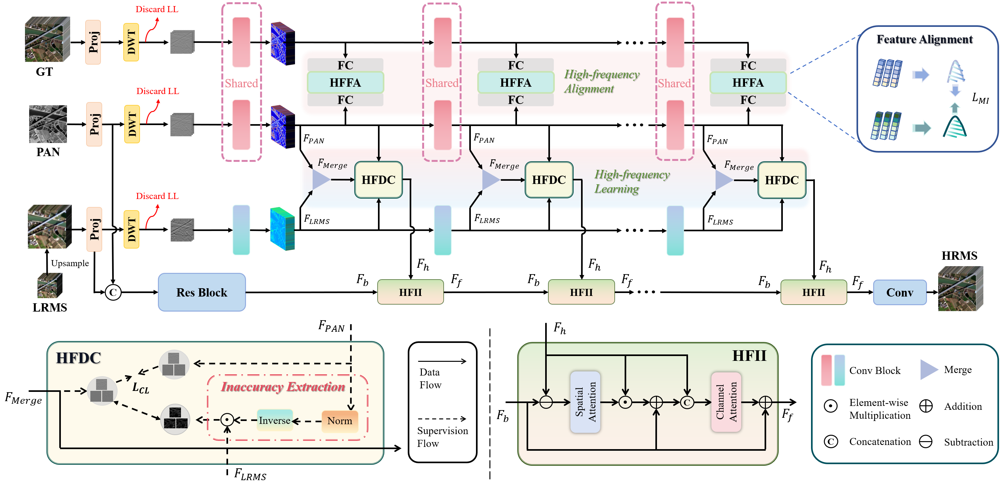

<h1>
  ChenxuWu - 吴晨旭
</h1>
<!--
  if center use <h1 align="center">
-->

I am a student in Southeast University  
 
 

- oriend2002@gmail.com
- 213212319@seu.edu.cn

- [Google Scholar](https://scholar.google.com/citations?user=zF4AHKQAAAAJ&hl=zh-CN&authuser=1 "Google Scholar")

***
<h2>
  

    Research Interest 
  

</h2>

  
  
  **Artificial Intellengence** | *Machine Learning* | ***Human-like Network***

   
  

<!--  
  <em> Artificial Intellengence </em> | <strong> Machine Learning </strong> | <em> <strong> Human-like Network </strong> </em>
-->

***

<h2>
  

    Hobbies 
  

</h2>

  

-  Reading all kinds of books

-  Drawing &  Calligraphy

-  Admiring [Pure Music](https://c6.y.qq.com/base/fcgi-bin/u?__=nyaEd6R4tQR8 "QQMusic")

***

<h2>
  

    News 
  

</h2>

 
 **[2025/xx/xx]**  
 **[2024/xx/xx]**  
 **[2023/xx/xx]**  
 **[2022/xx/xx]**  
 **[2021/xx/xx]**  

 More 

  
 **[2021/xx/xx]**  
 **[2021/xx/xx]**  

***

<h2>
  

    Publications 
  

</h2>

  

  [**A General Cooperative Optimization Driven High-Frequency Enhancement Framework for Multi-Spectral Image Fusion**](https://ieeexplore.ieee.org/abstract/document/10897307) 
  

  Chentong Huang,
  Junming Hou, 
  <strong>Chenxu Wu</strong>, 
  <a href="https://scholar.google.com/citations?user=a63pdHkAAAAJ&hl=zh-CN&oi=sra"> Xiaofeng Cong </a>, 
  <a href="https://scholar.google.com/citations?user=Q65jTroAAAAJ&hl=zh-CN&oi=sra"> Man Zhou </a>, 
  <a href="https://scholar.google.com/citations?user=zU2r_A4AAAAJ&hl=zh-CN&oi=ao"> Junling Li </a>
   
  

  [*IEEE TGAS*](https://ieeexplore.ieee.org/xpl/RecentIssue.jsp?punumber=36)
  
  [Github](https://github.com/Vcocoi/Cooperative-Optimization-Driven-High-Frequency-Enhancement-Framework) / [BibTex](https://scholar.googleusercontent.com/scholar.bib?q=info:FYvstESYvIEJ:scholar.google.com/&output=citation&scisdr=ClHnESqZEIqgrXaUALk:AFWwaeYAAAAAZ8aSGLg3kE67iW30PHjwDYmvwr4&scisig=AFWwaeYAAAAAZ8aSGLzA-uddPKUgxhd8PaKxYnE&scisf=4&ct=citation&cd=-1&hl=zh-CN)

  Low-Level, High-frequency Enhancement

##

  

  [**A General Cooperative Optimization Driven High-Frequency Enhancement Framework for Multi-Spectral Image Fusion**](https://ieeexplore.ieee.org/abstract/document/10897307) 
  

  Chentong Huang,
  Junming Hou, 
  <strong>Chenxu Wu</strong>, 
  <a href="https://scholar.google.com/citations?user=a63pdHkAAAAJ&hl=zh-CN&oi=sra"> Xiaofeng Cong </a>, 
  <a href="https://scholar.google.com/citations?user=Q65jTroAAAAJ&hl=zh-CN&oi=sra"> Man Zhou </a>, 
  <a href="https://scholar.google.com/citations?user=zU2r_A4AAAAJ&hl=zh-CN&oi=ao"> Junling Li </a>
   
  

  [*IEEE TGAS*](https://ieeexplore.ieee.org/xpl/RecentIssue.jsp?punumber=36)
  
  [Github](https://github.com/Vcocoi/Cooperative-Optimization-Driven-High-Frequency-Enhancement-Framework) / [BibTex](https://scholar.googleusercontent.com/scholar.bib?q=info:FYvstESYvIEJ:scholar.google.com/&output=citation&scisdr=ClHnESqZEIqgrXaUALk:AFWwaeYAAAAAZ8aSGLg3kE67iW30PHjwDYmvwr4&scisig=AFWwaeYAAAAAZ8aSGLzA-uddPKUgxhd8PaKxYnE&scisf=4&ct=citation&cd=-1&hl=zh-CN)

  Low-Level, High-frequency Enhancement

<!--

 More 

  
 **[2021/xx/xx]**  
 **[2021/xx/xx]**  

-->

***

<h2>
  

    Education & Work 
  

</h2>

- **[xxxx/xx/xx-xxxx/xx/xx] VeriSilicon** 

- **[2021/09/01-2025/06/30] Southeast University** 

***

