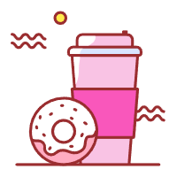

  

<h1>
  ChenxuWu - 吴晨旭
</h1>
<!--
  if center use <h1 align="center">
-->

I am a student in Southeast University  
 
 

- oriend2002@gmail.com
- 213212319@seu.edu.cn

- [Google Scholar](https://scholar.google.com/citations?user=zF4AHKQAAAAJ&hl=zh-CN&authuser=1 "Google Scholar")

***

<h3>
    
 
       Research Interest  
    

</h3>

  
  
  **Artificial Intellengence** | *Machine Learning* | ***Human-like Network***

   
  

<!--  
  <em> Artificial Intellengence </em> | <strong> Machine Learning </strong> | <em> <strong> Human-like Network </strong> </em>
-->

***

<h3>
  

    Hobbies 
  

</h3>

  

-  Reading all kinds of books

-  Drawing &  Calligraphy

-  Admiring [Pure Music](https://c6.y.qq.com/base/fcgi-bin/u?__=nyaEd6R4tQR8 "QQMusic")

***

<h3>
  

    News 
  

</h3>

 
 **[2025/xx/xx]**  
 **[2024/xx/xx]**  
 **[2023/xx/xx]**  
 **[2022/xx/xx]**  
 **[2021/xx/xx]**  

<!--

 More 

  
 **[2021/xx/xx]**  
 **[2021/xx/xx]**  

-->

***

<h3>
  

    Publications 
  

</h3>

